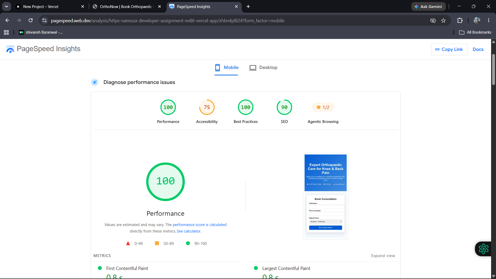

# OrthoNow – Marketing Tracking & Landing Page Project

## Overview

This project demonstrates a complete marketing tracking setup for OrthoNow including:

* GTM event tracking design
* GA4 funnel tracking
* Google Ads conversion setup
* Landing page with lead capture
* CRM + WhatsApp integration architecture

---

## Tech Stack

* HTML
* CSS
* JavaScript
* Google Tag Manager (concept)
* Google Analytics 4 (concept)
* HubSpot CRM (integration design)
* Karix WhatsApp API (integration design)

---

## Project Structure

```
Task-1-GTM-Event-Schema/
Task-2-Landing-Page/
Task-3-Integration-Design/
assets/
README.md
```

---

## How to Run

Just open:

```
Task-2-Landing-Page/index.html
```

No installation required.

---

## Features

* Multi-step booking tracking using dataLayer
* GA4 funnel tracking design
* CRM integration logic (HubSpot)
* WhatsApp automation (Karix)
* Lead capture landing page
* Conversion tracking setup

---

## PageSpeed Performance Screenshot



---

## Author

Marketing & Analytics Assignment Submission
